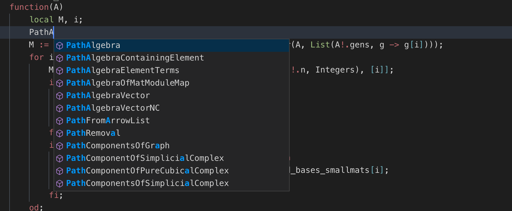

# GAP language support

This package provides support for syntax highlighting and basic autocompletion in GAP files (https://www.gap-system.org). It provides autocompletion for GAP keywords and functions (including all official packages), as well as text based completion based on all currently open GAP files.

This package is based on the packages [vscode-allautocomplete](https://github.com/atishay/vscode-allautocomplete) and [language-gap](https://github.com/ChrisJefferson/language-gap).

## Things to note

This package provides highlighting and completion for **all** GAP packages. It may take a few seconds after opening the first GAP file before autocompletions start being offered, but once fully loaded they are snappy.  

## Screenshots

